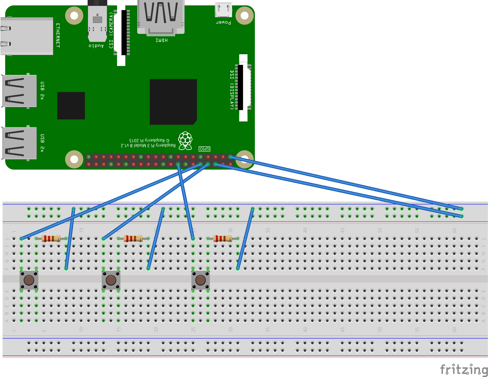
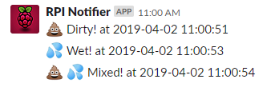

# diaper-tracker


### "As a Dad, so that I can track my sons diaper changes without sleepily forgetting, I need a means of logging and notifying myself"
----

This is a simple setup with a Raspberry Pi 3 and a python script to detect a button push and post a message to a slack channel for later recording and metric gathering (We're not thinking clearly throughout the night).

#### Requires:
+ Raspberry Pi 3
+ Python v3.x
+ Slack Channel and Webhook
+ 3 IM206 Tact switch
+ 3 220 Ohm resistors
+ wires
+ crying child needing a diaper change

#### Schematic


#### Execution
```bash
python trackDiaper.py &
```

#### Output

